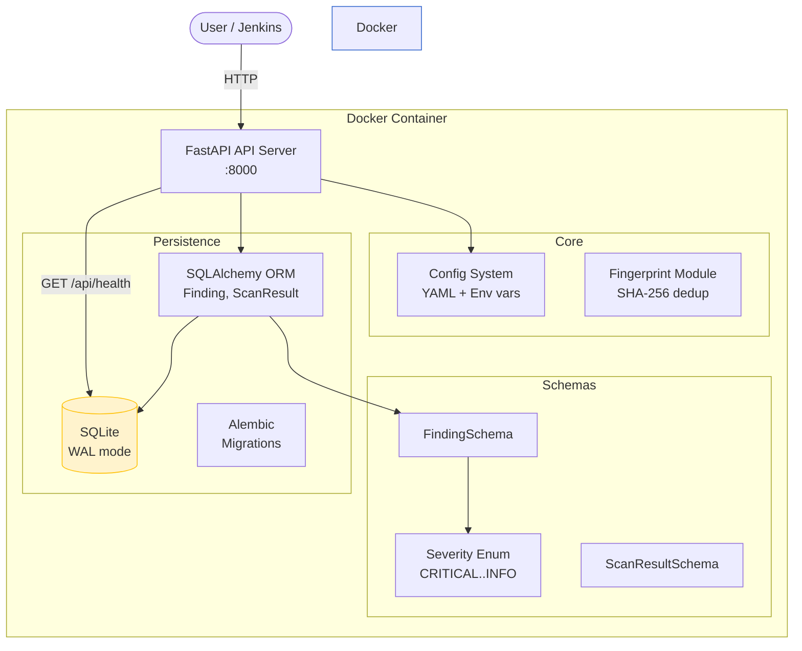
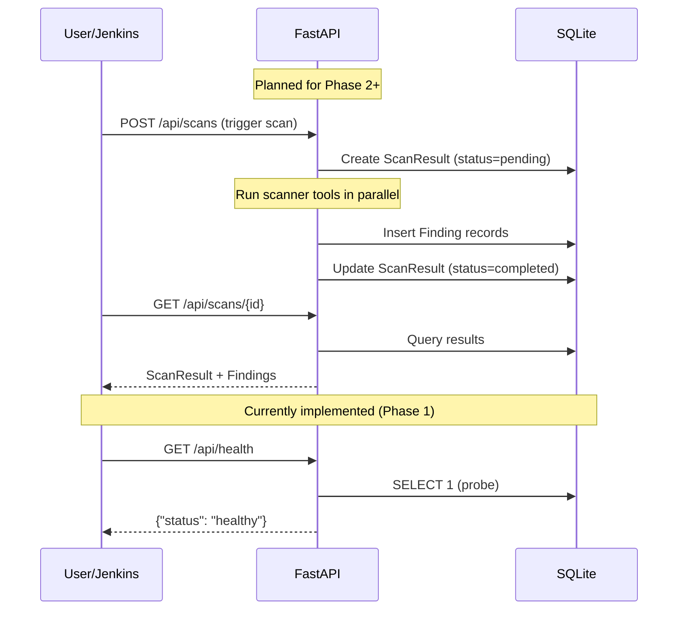

# Architecture / Архитектура

## Overview / Обзор

aipix-security-scanner is a multi-layer security scanning pipeline. It scans source code for vulnerabilities using static analysis tools, enriches findings with AI analysis, and produces reports with fix suggestions.

aipix-security-scanner — многоуровневый конвейер сканирования безопасности. Сканирует исходный код на уязвимости с помощью инструментов статического анализа, обогащает результаты ИИ-анализом и генерирует отчёты с предложениями по исправлению.

## Component Diagram / Диаграмма компонентов

## Data Flow / Поток данных

## Layered Scanning Approach / Многоуровневый подход

| Layer / Уровень | Tools / Инструменты | Time / Время | Status / Статус |
|-------|-------|------|--------|
| 1 — Static Analysis | Semgrep, cppcheck, Gitleaks, Trivy, Checkov | 2-4 min | Planned (Phase 2) |
| 2 — AI Analysis | Claude API (semantic review) | 1-2 min | Planned (Phase 3) |
| 3 — Reporting | Jinja2 + WeasyPrint (HTML/PDF) | <30s | Planned (Phase 4) |
| Quality Gate | Severity threshold check | <1s | Planned (Phase 5) |

## Current State (Phase 1) / Текущее состояние (Фаза 1)

Implemented / Реализовано:
- **Config system** — YAML file + environment variable overrides (SCANNER_* prefix)
- **Pydantic schemas** — FindingSchema, ScanResultSchema, Severity enum
- **Fingerprint module** — deterministic SHA-256 hashing for finding deduplication
- **SQLAlchemy ORM** — Finding and ScanResult models with async SQLite/WAL
- **FastAPI** — application factory with health endpoint (`GET /api/health`)
- **Alembic** — migration skeleton (tables auto-created on startup for now)
- **Docker** — single `docker compose up` deployment

## Key Design Decisions / Ключевые архитектурные решения

| Decision / Решение | Rationale / Обоснование |
|---------|-----------|
| SQLite over PostgreSQL | Portability — single file, no external dependencies / Портативность — один файл, без внешних зависимостей |
| WAL mode | Allows concurrent reads during writes / Параллельное чтение при записи |
| Async SQLAlchemy | Non-blocking DB operations for FastAPI / Неблокирующие операции с БД |
| Pydantic v2 schemas | Validation at API boundary, separate from ORM models / Валидация на границе API, отдельно от ORM |
| Deterministic fingerprints | Dedup findings across scans by normalizing path+rule+snippet / Дедупликация находок между сканами |
| Non-root Docker user | Security best practice / Практика безопасности |
