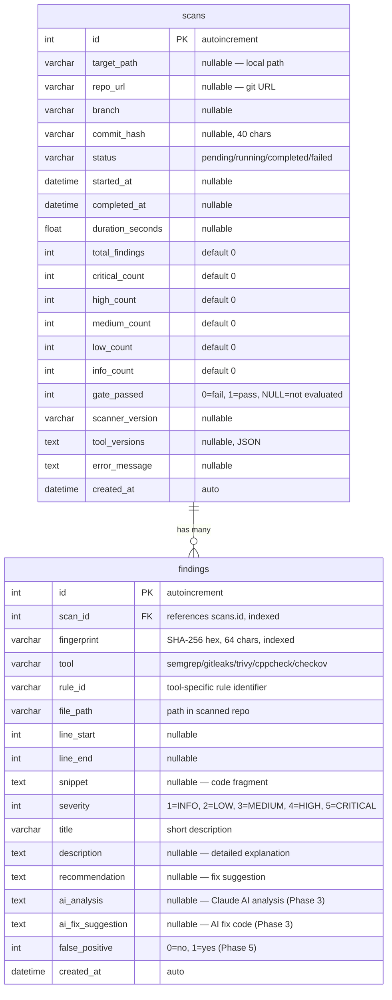

# Database Schema / Схема базы данных

## Overview / Обзор

SQLite database with WAL (Write-Ahead Logging) mode for concurrent read access. Managed by SQLAlchemy ORM with Alembic migrations.

База данных SQLite с режимом WAL для параллельного чтения. Управляется через SQLAlchemy ORM с миграциями Alembic.

## ER Diagram / ER-диаграмма



## Severity Levels / Уровни серьёзности

| Value | Name | Description (EN) | Описание (RU) |
|-------|------|-------------------|---------------|
| 5 | CRITICAL | Immediate exploitation risk | Непосредственный риск эксплуатации |
| 4 | HIGH | Serious vulnerability | Серьёзная уязвимость |
| 3 | MEDIUM | Moderate risk | Умеренный риск |
| 2 | LOW | Minor issue | Незначительная проблема |
| 1 | INFO | Informational finding | Информационная находка |

## SQLite Pragmas / Настройки SQLite

Applied on every connection / Применяются при каждом соединении:

```sql
PRAGMA journal_mode=WAL;      -- Write-Ahead Logging for concurrent reads
PRAGMA synchronous=NORMAL;     -- Balance between safety and speed
PRAGMA foreign_keys=ON;        -- Enforce FK constraints
```

## Indexes / Индексы

| Table | Column | Purpose / Назначение |
|-------|--------|---------------------|
| findings | scan_id | Fast lookup by scan / Быстрый поиск по скану |
| findings | fingerprint | Deduplication queries / Запросы дедупликации |

## Database Location / Расположение БД

| Environment | Path |
|-------------|------|
| Docker | `/data/scanner.db` (named volume `scanner_data`) |
| Local dev | Configured via `SCANNER_DB_PATH` env var or `config.yml` |

## Migrations / Миграции

Alembic is configured but not yet active. In Phase 1, tables are auto-created on application startup via `Base.metadata.create_all()`. Full Alembic migrations will be used starting from Phase 2.

Alembic настроен, но пока не активен. В Фазе 1 таблицы создаются автоматически при запуске через `Base.metadata.create_all()`. Полноценные миграции Alembic будут использоваться начиная с Фазы 2.

```bash
# Future usage / Будущее использование:
alembic revision --autogenerate -m "description"
alembic upgrade head
```
