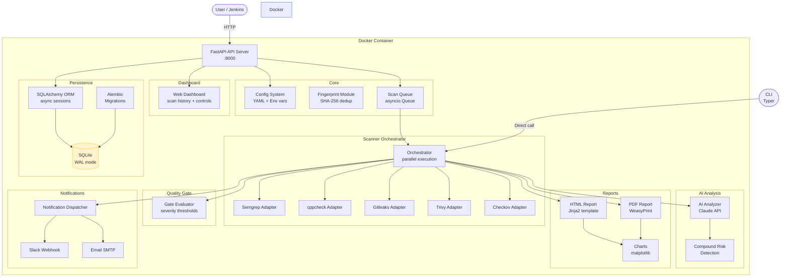
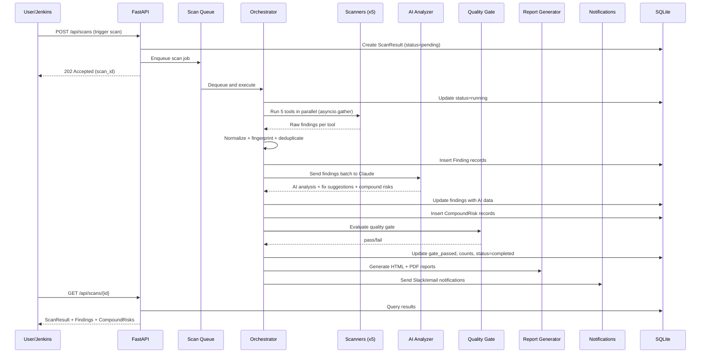

# Architecture

## Overview

Security AI Scanner is a multi-layer security scanning pipeline for the aipix.ai VSaaS platform. It scans source code repositories for vulnerabilities using five parallel static analysis tools, enriches findings with AI-powered analysis via Claude, and produces actionable reports with fix suggestions. A configurable quality gate can block deployments when critical issues are found.

## Component Diagram

## Data Flow

The scan lifecycle from API trigger to notification:

## Technology Choices

| Technology | Purpose | Rationale |
|-----------|---------|-----------|
| SQLite (WAL) | Database | Portability -- single file, no external dependencies, concurrent reads |
| Async SQLAlchemy | ORM | Non-blocking DB operations for FastAPI async handlers |
| Pydantic v2 | Validation | Strict typing at API boundary, separate from ORM models |
| FastAPI | API + Dashboard | Async support, auto-generated OpenAPI docs, dependency injection |
| asyncio.gather | Scanner parallelism | Run 5 tools concurrently without threading overhead |
| Fingerprinting | Dedup | SHA-256 hash of path+rule+snippet for cross-scan deduplication |
| WeasyPrint | PDF generation | Pure Python, CSS-based layout for report PDFs |
| Jinja2 PackageLoader | Templates | Discover templates within installed scanner package |
| matplotlib (Agg) | Charts | Headless server-side chart rendering as base64 PNG data URIs |
| Typer | CLI | Subcommand-based CLI for direct scan execution |

## Security Model

- **API key authentication** -- all scan endpoints require `X-API-Key` header, validated with `secrets.compare_digest` for timing-safe comparison
- **Non-root Docker user** -- the `scanner` user runs the application inside the container
- **Secrets via environment** -- API keys and SMTP passwords are never stored in config files; they use `SCANNER_*` environment variables
- **Read-only config mount** -- `config.yml` is mounted as read-only in Docker

## Configuration

All settings follow a priority chain: constructor arguments > environment variables (`SCANNER_*` prefix) > `.env` file > Docker secrets > `config.yml` (lowest priority).

Key environment variables:

| Variable | Purpose |
|----------|---------|
| `SCANNER_API_KEY` | API authentication key |
| `SCANNER_CLAUDE_API_KEY` | Anthropic API key for AI analysis |
| `SCANNER_DB_PATH` | SQLite database file path |
| `SCANNER_PORT` | Server listen port |
| `SCANNER_CONFIG_PATH` | Path to YAML config file |

See the [Admin Guide](admin-guide.md) for complete configuration reference.
