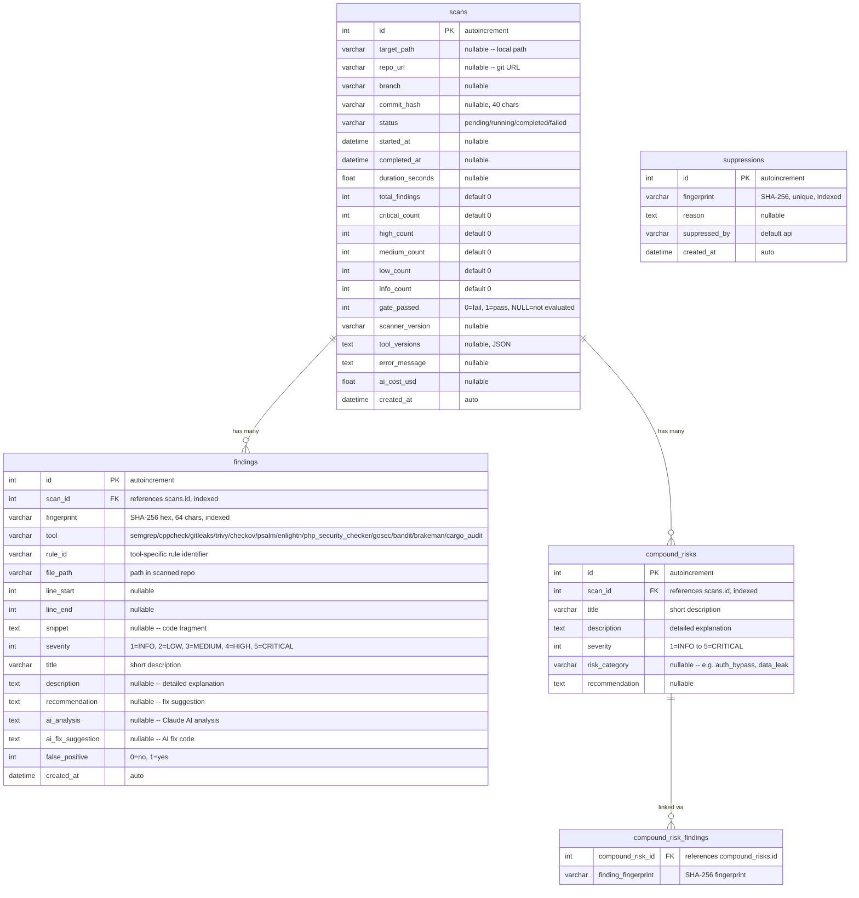

# Database Schema

## Overview

SQLite database with WAL (Write-Ahead Logging) mode for concurrent read access. Managed by SQLAlchemy 2.0 async ORM with Alembic migrations.

## ER Diagram



## Models

### ScanResult

Tracks a single scan execution from trigger to completion. Stores aggregate severity counts for fast dashboard queries. The `gate_passed` field records whether the quality gate passed (1), failed (0), or was not evaluated (NULL).

### Finding

A normalized security vulnerability found by one of the twelve scanner tools. Each finding has a deterministic `fingerprint` (SHA-256 of normalized path + rule_id + snippet) for cross-scan deduplication. AI enrichment fields (`ai_analysis`, `ai_fix_suggestion`) are populated after Claude analysis.

### CompoundRisk

An AI-identified compound risk that spans multiple individual findings. For example, an authentication bypass in one component combined with an IDOR in another. Linked to related findings via the `compound_risk_findings` association table using fingerprints.

### Suppression

Tracks fingerprints that have been marked as false positives. When a finding's fingerprint matches a suppression record, it is excluded from quality gate evaluation and report counts.

## Severity Levels

| Value | Name | Action Required |
|-------|------|-----------------|
| 5 | CRITICAL | Fix immediately, blocks deployment |
| 4 | HIGH | Fix before release |
| 3 | MEDIUM | Fix in current sprint |
| 2 | LOW | Fix when convenient |
| 1 | INFO | Informational, no action needed |

## Indexes

| Table | Column(s) | Purpose |
|-------|-----------|---------|
| findings | scan_id | Fast lookup of findings by scan |
| findings | fingerprint | Deduplication and suppression queries |
| compound_risks | scan_id | Fast lookup of compound risks by scan |
| suppressions | fingerprint | Fast suppression matching (unique constraint) |

## SQLite Configuration

Applied on every connection via SQLAlchemy event listeners:

```sql
PRAGMA journal_mode=WAL;      -- Write-Ahead Logging for concurrent reads
PRAGMA synchronous=NORMAL;     -- Balance between safety and speed
PRAGMA foreign_keys=ON;        -- Enforce FK constraints
```

## Database Location

| Environment | Path |
|-------------|------|
| Docker | `/data/scanner.db` (named volume `scanner_data`) |
| Local dev | Configured via `SCANNER_DB_PATH` env var or `db_path` in `config.yml` |

## Migrations

Alembic is configured for schema migrations. Tables are auto-created on application startup via `Base.metadata.create_all()` in the FastAPI lifespan handler.

```bash
# Generate a new migration
alembic revision --autogenerate -m "description"

# Apply migrations
alembic upgrade head
```
