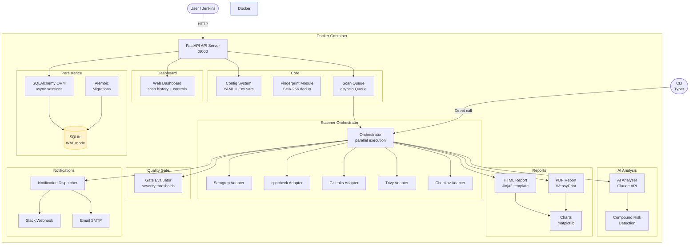
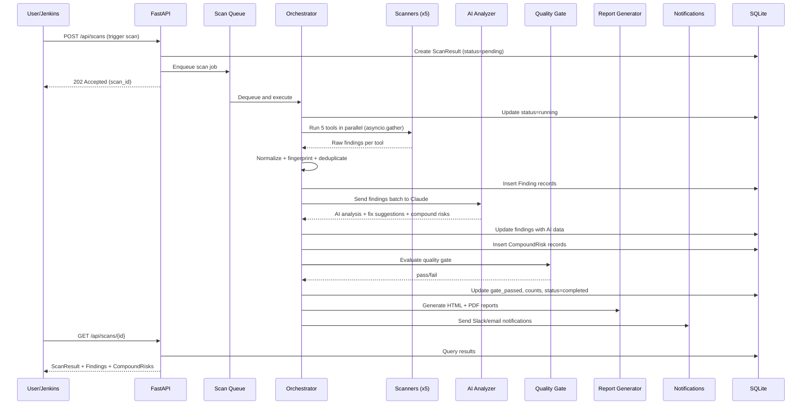

# Arquitectura

## Descripción General

Security AI Scanner es un pipeline de seguridad multicapa para la plataforma VSaaS de aipix.ai. Analiza repositorios de código fuente en busca de vulnerabilidades utilizando cinco herramientas de análisis estático en paralelo, enriquece los hallazgos con análisis impulsado por IA a través de Claude, y produce informes accionables con sugerencias de corrección. Un quality gate configurable puede bloquear despliegues cuando se encuentran problemas críticos.

## Diagrama de Componentes

## Flujo de Datos

El ciclo de vida del escaneo desde el disparador de la API hasta la notificación:

## Decisiones Tecnológicas

| Tecnología | Propósito | Justificación |
|-----------|---------|-----------|
| SQLite (WAL) | Base de datos | Portabilidad -- archivo único, sin dependencias externas, lecturas concurrentes |
| Async SQLAlchemy | ORM | Operaciones de BD no bloqueantes para los manejadores asíncronos de FastAPI |
| Pydantic v2 | Validación | Tipado estricto en la frontera de la API, separado de los modelos ORM |
| FastAPI | API + Dashboard | Soporte asíncrono, documentación OpenAPI autogenerada, inyección de dependencias |
| asyncio.gather | Paralelismo de escáneres | Ejecutar 5 herramientas concurrentemente sin overhead de hilos |
| Fingerprinting | Deduplicación | Hash SHA-256 de ruta+regla+fragmento para deduplicación entre escaneos |
| WeasyPrint | Generación de PDF | Python puro, diseño basado en CSS para los PDF de informes |
| Jinja2 PackageLoader | Plantillas | Descubre plantillas dentro del paquete del escáner instalado |
| matplotlib (Agg) | Gráficos | Renderizado de gráficos sin cabeza en el servidor como URI de datos PNG en base64 |
| Typer | CLI | CLI basada en subcomandos para ejecución directa de escaneos |

## Modelo de Seguridad

- **Autenticación mediante API key** -- todos los endpoints de escaneo requieren el encabezado `X-API-Key`, validado con `secrets.compare_digest` para comparación segura en tiempo constante
- **Usuario Docker sin privilegios root** -- el usuario `scanner` ejecuta la aplicación dentro del contenedor
- **Secretos vía entorno** -- las claves API y contraseñas SMTP nunca se almacenan en archivos de configuración; se utilizan las variables de entorno `SCANNER_*`
- **Montaje de configuración en solo lectura** -- `config.yml` se monta como solo lectura en Docker

## Configuración

Todos los ajustes siguen una cadena de prioridad: argumentos del constructor > variables de entorno (prefijo `SCANNER_*`) > archivo `.env` > secretos de Docker > `config.yml` (menor prioridad).

Variables de entorno clave:

| Variable | Propósito |
|----------|---------|
| `SCANNER_API_KEY` | Clave de autenticación de la API |
| `SCANNER_CLAUDE_API_KEY` | Clave API de Anthropic para el análisis con IA |
| `SCANNER_DB_PATH` | Ruta al archivo de base de datos SQLite |
| `SCANNER_PORT` | Puerto de escucha del servidor |
| `SCANNER_CONFIG_PATH` | Ruta al archivo de configuración YAML |

Consulte la [Guía de Administración](admin-guide.md) para la referencia completa de configuración.
