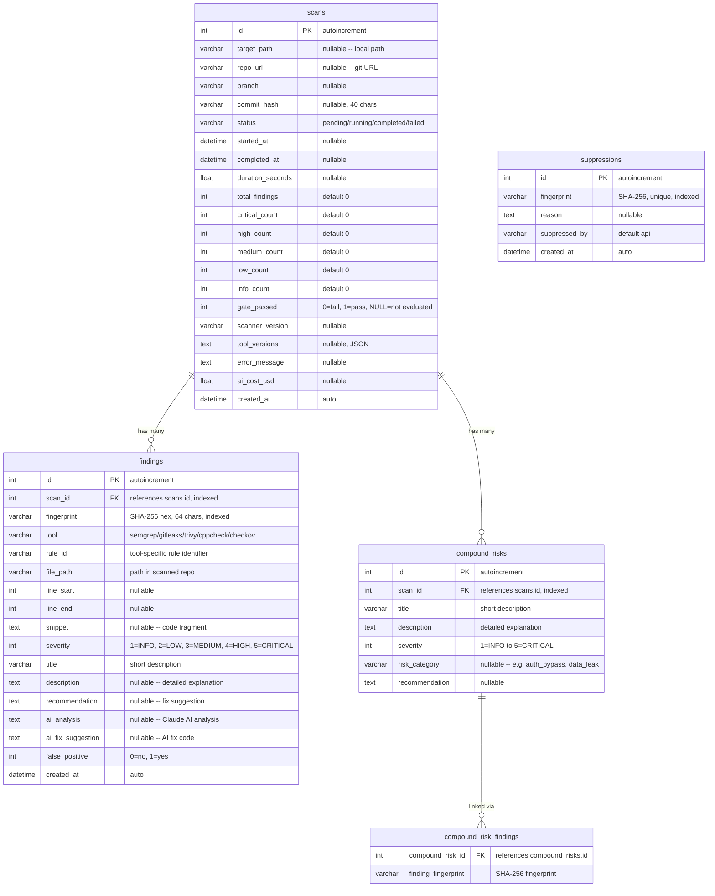

# Esquema de Base de Datos

## Descripción General

Base de datos SQLite en modo WAL (Write-Ahead Logging) para acceso de lectura concurrente. Gestionada por el ORM asíncrono de SQLAlchemy 2.0 con migraciones de Alembic.

## Diagrama ER



## Modelos

### ScanResult

Registra una ejecución individual de escaneo desde su inicio hasta su finalización. Almacena recuentos agregados de severidad para consultas rápidas en el panel de control. El campo `gate_passed` indica si el quality gate pasó (1), falló (0), o no fue evaluado (NULL).

### Finding

Una vulnerabilidad de seguridad normalizada encontrada por una de las cinco herramientas de escaneo. Cada hallazgo tiene un `fingerprint` determinístico (SHA-256 de ruta normalizada + rule_id + fragmento) para deduplicación entre escaneos. Los campos de enriquecimiento con IA (`ai_analysis`, `ai_fix_suggestion`) se completan tras el análisis con Claude.

### CompoundRisk

Un riesgo compuesto identificado por IA que abarca múltiples hallazgos individuales. Por ejemplo, una omisión de autenticación en un componente combinada con un IDOR en otro. Se vincula a los hallazgos relacionados a través de la tabla de asociación `compound_risk_findings` usando fingerprints.

### Suppression

Registra los fingerprints que han sido marcados como falsos positivos. Cuando el fingerprint de un hallazgo coincide con un registro de supresión, este queda excluido de la evaluación del quality gate y de los recuentos en los informes.

## Niveles de Severidad

| Valor | Nombre | Acción Requerida |
|-------|------|-----------------|
| 5 | CRITICAL | Corregir de inmediato, bloquea el despliegue |
| 4 | HIGH | Corregir antes del lanzamiento |
| 3 | MEDIUM | Corregir en el sprint actual |
| 2 | LOW | Corregir cuando sea conveniente |
| 1 | INFO | Informativo, no requiere acción |

## Índices

| Tabla | Columna(s) | Propósito |
|-------|-----------|---------|
| findings | scan_id | Búsqueda rápida de hallazgos por escaneo |
| findings | fingerprint | Consultas de deduplicación y supresión |
| compound_risks | scan_id | Búsqueda rápida de riesgos compuestos por escaneo |
| suppressions | fingerprint | Coincidencia rápida de supresiones (restricción única) |

## Configuración de SQLite

Aplicada en cada conexión mediante event listeners de SQLAlchemy:

```sql
PRAGMA journal_mode=WAL;      -- Write-Ahead Logging for concurrent reads
PRAGMA synchronous=NORMAL;     -- Balance between safety and speed
PRAGMA foreign_keys=ON;        -- Enforce FK constraints
```

## Ubicación de la Base de Datos

| Entorno | Ruta |
|-------------|------|
| Docker | `/data/scanner.db` (volumen con nombre `scanner_data`) |
| Desarrollo local | Configurado vía variable de entorno `SCANNER_DB_PATH` o `db_path` en `config.yml` |

## Migraciones

Alembic está configurado para las migraciones del esquema. Las tablas se crean automáticamente al iniciar la aplicación mediante `Base.metadata.create_all()` en el manejador del lifespan de FastAPI.

```bash
# Generate a new migration
alembic revision --autogenerate -m "description"

# Apply migrations
alembic upgrade head
```
