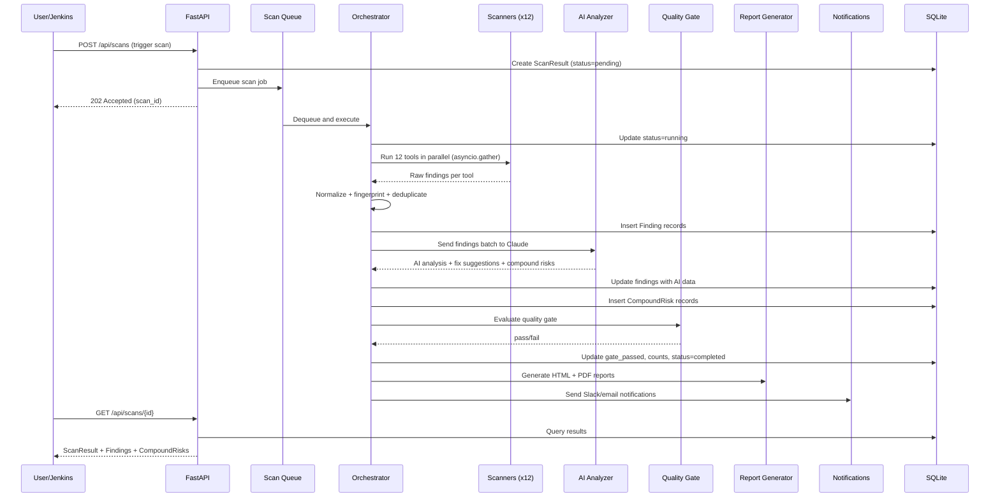

# Architecture

## Vue d'ensemble

Security AI Scanner est un pipeline d'analyse de securite multicouche pour la plateforme VSaaS aipix.ai. Il analyse les depots de code source a la recherche de vulnerabilites a l'aide de douze outils de scan de securite paralleles, enrichit les resultats par une analyse IA via Claude, et produit des rapports exploitables avec des suggestions de correction. Les scanners sont charges dynamiquement via un registre de plugins base sur la configuration. Une quality gate configurable peut bloquer les deploiements lorsque des problemes critiques sont detectes.

## Diagramme des composants

```mermaid
graph TB
    subgraph Docker Container
        API[FastAPI API Server<br/>:8000]

        subgraph Core
            CFG[Config System<br/>YAML + Env vars]
            FP[Fingerprint Module<br/>SHA-256 dedup]
            QUEUE[Scan Queue<br/>asyncio.Queue]
        end

        subgraph Scanner Orchestrator
            ORCH[Orchestrator<br/>parallel execution]
            REG[ScannerRegistry<br/>config-driven loading]
            SEM[Semgrep Adapter]
            CPP[cppcheck Adapter]
            GLK[Gitleaks Adapter]
            TRV[Trivy Adapter]
            CHK[Checkov Adapter]
            PSA[Psalm Adapter]
            ENL[Enlightn Adapter]
            PSC[PHP Security Checker]
            GSC[gosec Adapter]
            BND[Bandit Adapter]
            BRK[Brakeman Adapter]
            CGA[cargo-audit Adapter]
        end

        subgraph AI Analysis
            AI[AI Analyzer<br/>Claude API]
            CR[Compound Risk<br/>Detection]
        end

        subgraph Reports
            HTML[HTML Report<br/>Jinja2 template]
            PDF[PDF Report<br/>WeasyPrint]
            CHARTS[Charts<br/>matplotlib]
        end

        subgraph Quality Gate
            GATE[Gate Evaluator<br/>severity thresholds]
        end

        subgraph Dashboard
            DASH[Web Dashboard<br/>scan history + controls]
        end

        subgraph Notifications
            NOTIF[Notification Dispatcher]
            SLACK[Slack Webhook]
            EMAIL[Email SMTP]
        end

        subgraph Persistence
            ORM[SQLAlchemy ORM<br/>async sessions]
            DB[(SQLite<br/>WAL mode)]
            ALM[Alembic<br/>Migrations]
        end

        API --> CFG
        API --> QUEUE
        QUEUE --> ORCH
        ORCH --> REG
        REG --> SEM
        REG --> CPP
        REG --> GLK
        REG --> TRV
        REG --> CHK
        REG --> PSA
        REG --> ENL
        REG --> PSC
        REG --> GSC
        REG --> BND
        REG --> BRK
        REG --> CGA
        ORCH --> AI
        AI --> CR
        ORCH --> GATE
        ORCH --> HTML
        ORCH --> PDF
        HTML --> CHARTS
        PDF --> CHARTS
        ORCH --> NOTIF
        NOTIF --> SLACK
        NOTIF --> EMAIL
        API --> DASH
        API --> ORM
        ORM --> DB
        ALM --> DB
    end

    User([User / Jenkins]) -->|HTTP| API
    CLI([CLI<br/>Typer]) -->|Direct call| ORCH

    style Docker Container fill:#f0f4ff,stroke:#3366cc
    style DB fill:#fff3cd,stroke:#ffc107
```

## Flux de données

Cycle de vie d'un scan depuis le déclenchement API jusqu'à la notification :

## Choix technologiques

| Technologie | Utilisation | Justification |
|-------------|-------------|---------------|
| SQLite (WAL) | Base de données | Portabilité -- fichier unique, pas de dépendances externes, lectures concurrentes |
| Async SQLAlchemy | ORM | Opérations DB non bloquantes pour les handlers async FastAPI |
| Pydantic v2 | Validation | Typage strict à la frontière API, séparé des modèles ORM |
| FastAPI | API + Dashboard | Support async, docs OpenAPI auto-générées, injection de dépendances |
| asyncio.gather | Parallelisme des scanners | Execution de 12 outils en concurrence sans surcharge de threads |
| Fingerprinting | Déduplication | Hash SHA-256 de path+rule+snippet pour la déduplication inter-scans |
| WeasyPrint | Génération PDF | Python pur, mise en page CSS pour les rapports PDF |
| Jinja2 PackageLoader | Templates | Découverte des templates dans le package scanner installé |
| matplotlib (Agg) | Graphiques | Rendu de graphiques côté serveur sans affichage, encodés en base64 PNG URI |
| Typer | CLI | CLI à sous-commandes pour l'exécution directe de scans |

## Modèle de sécurité

- **Authentification par jeton Bearer** -- tous les endpoints API (sauf /api/health) requierent un jeton Bearer valide dans le header Authorization ; les jetons sont generes par utilisateur depuis le tableau de bord
- **Utilisateur Docker non-root** -- l'utilisateur `scanner` exécute l'application dans le conteneur
- **Secrets via les variables d'environnement** -- les clés API et mots de passe SMTP ne sont jamais stockés dans les fichiers de configuration ; ils utilisent les variables d'environnement `SCANNER_*`
- **Montage config en lecture seule** -- `config.yml` est monté en lecture seule dans Docker

## Configuration

Tous les paramètres suivent une chaîne de priorité : arguments du constructeur > variables d'environnement (préfixe `SCANNER_*`) > fichier `.env` > secrets Docker > `config.yml` (priorité la plus basse).

Variables d'environnement clés :

| Variable | Utilisation |
|----------|-------------|
| `SCANNER_API_KEY` | Clé d'authentification API |
| `SCANNER_CLAUDE_API_KEY` | Clé API Anthropic pour l'analyse IA |
| `SCANNER_DB_PATH` | Chemin du fichier de base de données SQLite |
| `SCANNER_PORT` | Port d'écoute du serveur |
| `SCANNER_CONFIG_PATH` | Chemin vers le fichier de configuration YAML |

Consultez le [Guide administrateur](admin-guide.md) pour la référence de configuration complète.
