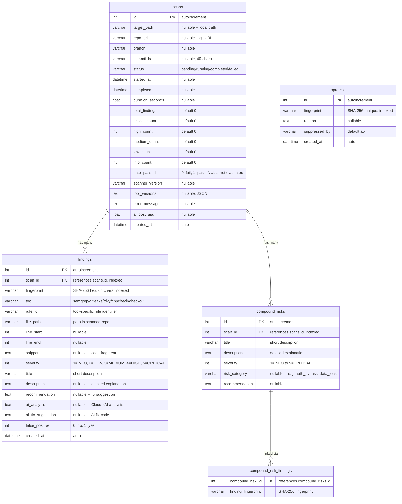

# Schéma de base de données

## Vue d'ensemble

Base de données SQLite en mode WAL (Write-Ahead Logging) pour un accès en lecture concurrent. Gérée par SQLAlchemy 2.0 async ORM avec les migrations Alembic.

## Diagramme ER



## Modèles

### ScanResult

Suit l'exécution d'un scan unique depuis le déclenchement jusqu'à la complétion. Stocke les comptages agrégés de sévérité pour des requêtes rapides sur le tableau de bord. Le champ `gate_passed` enregistre si la quality gate est passée (1), échouée (0), ou non évaluée (NULL).

### Finding

Une vulnérabilité de sécurité normalisée trouvée par l'un des cinq outils de scan. Chaque résultat possède une `fingerprint` déterministe (SHA-256 du chemin normalisé + rule_id + snippet) pour la déduplication inter-scans. Les champs d'enrichissement IA (`ai_analysis`, `ai_fix_suggestion`) sont remplis après l'analyse par Claude.

### CompoundRisk

Un risque composé identifié par l'IA qui englobe plusieurs résultats individuels. Par exemple, un contournement d'authentification dans un composant combiné à un IDOR dans un autre. Lié aux résultats associés via la table d'association `compound_risk_findings` en utilisant les empreintes.

### Suppression

Suit les empreintes qui ont été marquées comme faux positifs. Lorsque l'empreinte d'un résultat correspond à un enregistrement de suppression, il est exclu de l'évaluation de la quality gate et des comptages des rapports.

## Niveaux de sévérité

| Valeur | Nom | Action requise |
|--------|-----|----------------|
| 5 | CRITICAL | Corriger immédiatement, bloque le déploiement |
| 4 | HIGH | Corriger avant la mise en production |
| 3 | MEDIUM | Corriger dans le sprint actuel |
| 2 | LOW | Corriger dès que possible |
| 1 | INFO | Informatif, aucune action requise |

## Index

| Table | Colonne(s) | Utilisation |
|-------|------------|-------------|
| findings | scan_id | Recherche rapide des résultats par scan |
| findings | fingerprint | Déduplication et requêtes de suppression |
| compound_risks | scan_id | Recherche rapide des risques composés par scan |
| suppressions | fingerprint | Correspondance rapide des suppressions (contrainte unique) |

## Configuration SQLite

Appliquée à chaque connexion via les écouteurs d'événements SQLAlchemy :

```sql
PRAGMA journal_mode=WAL;      -- Write-Ahead Logging for concurrent reads
PRAGMA synchronous=NORMAL;     -- Balance between safety and speed
PRAGMA foreign_keys=ON;        -- Enforce FK constraints
```

## Emplacement de la base de données

| Environnement | Chemin |
|---------------|--------|
| Docker | `/data/scanner.db` (volume nommé `scanner_data`) |
| Dev local | Configuré via la variable d'environnement `SCANNER_DB_PATH` ou `db_path` dans `config.yml` |

## Migrations

Alembic est configuré pour les migrations de schéma. Les tables sont créées automatiquement au démarrage de l'application via `Base.metadata.create_all()` dans le gestionnaire de cycle de vie FastAPI.

```bash
# Générer une nouvelle migration
alembic revision --autogenerate -m "description"

# Appliquer les migrations
alembic upgrade head
```
