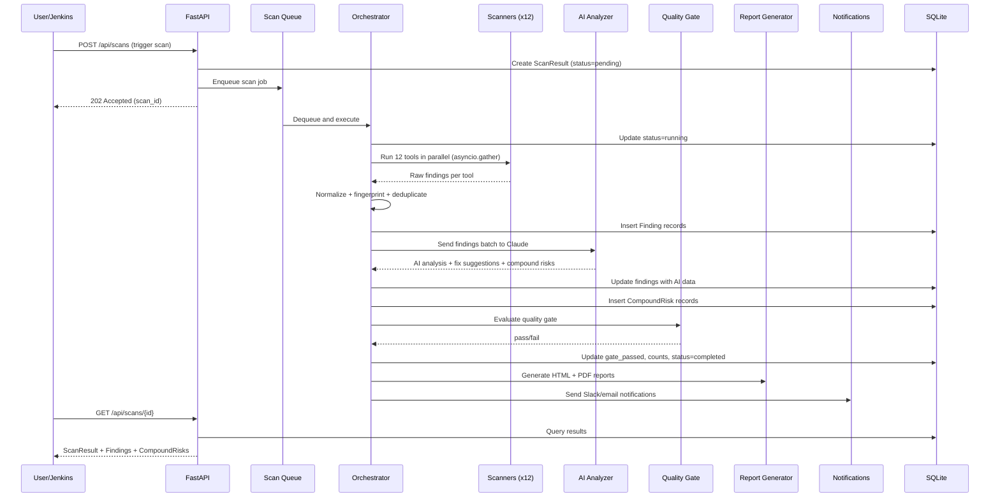

# Architettura

## Panoramica

Security AI Scanner e una pipeline di scansione della sicurezza a piu livelli per la piattaforma VSaaS aipix.ai. Analizza i repository di codice sorgente alla ricerca di vulnerabilita utilizzando dodici strumenti di scansione della sicurezza in parallelo, arricchisce i risultati con analisi basata su AI tramite Claude e produce report pratici con suggerimenti di correzione. Gli scanner vengono caricati dinamicamente tramite un registro di plugin basato sulla configurazione. Un quality gate configurabile puo bloccare i deployment quando vengono rilevati problemi critici.

## Diagramma dei Componenti

```mermaid
graph TB
    subgraph Docker Container
        API[FastAPI API Server<br/>:8000]

        subgraph Core
            CFG[Config System<br/>YAML + Env vars]
            FP[Fingerprint Module<br/>SHA-256 dedup]
            QUEUE[Scan Queue<br/>asyncio.Queue]
        end

        subgraph Scanner Orchestrator
            ORCH[Orchestrator<br/>parallel execution]
            REG[ScannerRegistry<br/>config-driven loading]
            SEM[Semgrep Adapter]
            CPP[cppcheck Adapter]
            GLK[Gitleaks Adapter]
            TRV[Trivy Adapter]
            CHK[Checkov Adapter]
            PSA[Psalm Adapter]
            ENL[Enlightn Adapter]
            PSC[PHP Security Checker]
            GSC[gosec Adapter]
            BND[Bandit Adapter]
            BRK[Brakeman Adapter]
            CGA[cargo-audit Adapter]
        end

        subgraph AI Analysis
            AI[AI Analyzer<br/>Claude API]
            CR[Compound Risk<br/>Detection]
        end

        subgraph Reports
            HTML[HTML Report<br/>Jinja2 template]
            PDF[PDF Report<br/>WeasyPrint]
            CHARTS[Charts<br/>matplotlib]
        end

        subgraph Quality Gate
            GATE[Gate Evaluator<br/>severity thresholds]
        end

        subgraph Dashboard
            DASH[Web Dashboard<br/>scan history + controls]
        end

        subgraph Notifications
            NOTIF[Notification Dispatcher]
            SLACK[Slack Webhook]
            EMAIL[Email SMTP]
        end

        subgraph Persistence
            ORM[SQLAlchemy ORM<br/>async sessions]
            DB[(SQLite<br/>WAL mode)]
            ALM[Alembic<br/>Migrations]
        end

        API --> CFG
        API --> QUEUE
        QUEUE --> ORCH
        ORCH --> REG
        REG --> SEM
        REG --> CPP
        REG --> GLK
        REG --> TRV
        REG --> CHK
        REG --> PSA
        REG --> ENL
        REG --> PSC
        REG --> GSC
        REG --> BND
        REG --> BRK
        REG --> CGA
        ORCH --> AI
        AI --> CR
        ORCH --> GATE
        ORCH --> HTML
        ORCH --> PDF
        HTML --> CHARTS
        PDF --> CHARTS
        ORCH --> NOTIF
        NOTIF --> SLACK
        NOTIF --> EMAIL
        API --> DASH
        API --> ORM
        ORM --> DB
        ALM --> DB
    end

    User([User / Jenkins]) -->|HTTP| API
    CLI([CLI<br/>Typer]) -->|Direct call| ORCH

    style Docker Container fill:#f0f4ff,stroke:#3366cc
    style DB fill:#fff3cd,stroke:#ffc107
```

## Flusso dei Dati

Il ciclo di vita della scansione dall'avvio tramite API alla notifica:

## Scelte Tecnologiche

| Tecnologia | Scopo | Motivazione |
|-----------|-------|-------------|
| SQLite (WAL) | Database | Portabilità -- file singolo, nessuna dipendenza esterna, letture concorrenti |
| Async SQLAlchemy | ORM | Operazioni DB non bloccanti per i gestori async di FastAPI |
| Pydantic v2 | Validazione | Tipizzazione rigorosa al confine API, separata dai modelli ORM |
| FastAPI | API + Dashboard | Supporto async, documentazione OpenAPI generata automaticamente, dependency injection |
| asyncio.gather | Parallelismo scanner | Esecuzione concorrente di 12 strumenti senza overhead del threading |
| Fingerprinting | Deduplicazione | Hash SHA-256 di path+rule+snippet per la deduplicazione tra scansioni |
| WeasyPrint | Generazione PDF | Python puro, layout CSS per i report PDF |
| Jinja2 PackageLoader | Template | Individuazione dei template all'interno del pacchetto scanner installato |
| matplotlib (Agg) | Grafici | Rendering lato server headless come URI di dati PNG in base64 |
| Typer | CLI | CLI basata su sottocomandi per l'esecuzione diretta delle scansioni |

## Modello di Sicurezza

- **Autenticazione tramite chiave API** -- tutti gli endpoint di scansione richiedono l'header `X-API-Key`, validato con `secrets.compare_digest` per un confronto sicuro rispetto al timing attack
- **Utente Docker non-root** -- l'utente `scanner` esegue l'applicazione all'interno del container
- **Segreti tramite variabili d'ambiente** -- le chiavi API e le password SMTP non vengono mai memorizzate nei file di configurazione; utilizzano le variabili d'ambiente `SCANNER_*`
- **Mount config in sola lettura** -- `config.yml` è montato in sola lettura in Docker

## Configurazione

Tutte le impostazioni seguono una catena di priorità: argomenti del costruttore > variabili d'ambiente (prefisso `SCANNER_*`) > file `.env` > Docker secrets > `config.yml` (priorità più bassa).

Variabili d'ambiente principali:

| Variabile | Scopo |
|-----------|-------|
| `SCANNER_API_KEY` | Chiave di autenticazione API |
| `SCANNER_CLAUDE_API_KEY` | Chiave API Anthropic per l'analisi AI |
| `SCANNER_DB_PATH` | Percorso del file database SQLite |
| `SCANNER_PORT` | Porta di ascolto del server |
| `SCANNER_CONFIG_PATH` | Percorso del file di configurazione YAML |

Consultare la [Guida amministratore](admin-guide.md) per il riferimento completo alla configurazione.
