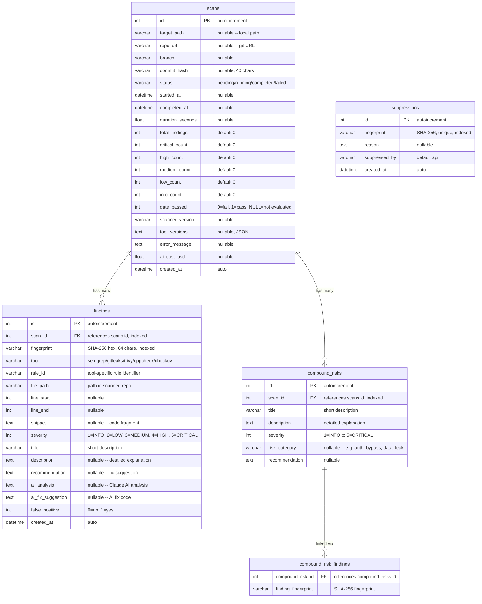

# Schema del Database

## Panoramica

Database SQLite in modalità WAL (Write-Ahead Logging) per l'accesso in lettura concorrente. Gestito da SQLAlchemy 2.0 async ORM con migrazioni Alembic.

## Diagramma ER



## Modelli

### ScanResult

Traccia una singola esecuzione di scansione dall'avvio al completamento. Memorizza conteggi aggregati di gravità per query rapide della dashboard. Il campo `gate_passed` registra se il quality gate è passato (1), fallito (0) o non è stato valutato (NULL).

### Finding

Una vulnerabilità di sicurezza normalizzata rilevata da uno dei cinque strumenti scanner. Ogni risultato ha un `fingerprint` deterministico (SHA-256 di path normalizzato + rule_id + snippet) per la deduplicazione tra scansioni. I campi di arricchimento AI (`ai_analysis`, `ai_fix_suggestion`) vengono popolati dopo l'analisi da parte di Claude.

### CompoundRisk

Un rischio composto identificato dall'AI che abbraccia più risultati individuali. Ad esempio, un bypass dell'autenticazione in un componente combinato con un IDOR in un altro. Collegato ai risultati correlati tramite la tabella di associazione `compound_risk_findings` utilizzando le fingerprint.

### Suppression

Traccia le fingerprint contrassegnate come falsi positivi. Quando la fingerprint di un risultato corrisponde a un record di soppressione, quel risultato viene escluso dalla valutazione del quality gate e dai conteggi dei report.

## Livelli di Gravità

| Valore | Nome | Azione Richiesta |
|--------|------|------------------|
| 5 | CRITICAL | Correggere immediatamente, blocca il deployment |
| 4 | HIGH | Correggere prima del rilascio |
| 3 | MEDIUM | Correggere nello sprint corrente |
| 2 | LOW | Correggere quando possibile |
| 1 | INFO | Informativo, nessuna azione necessaria |

## Indici

| Tabella | Colonna/e | Scopo |
|---------|-----------|-------|
| findings | scan_id | Ricerca rapida dei risultati per scansione |
| findings | fingerprint | Query di deduplicazione e soppressione |
| compound_risks | scan_id | Ricerca rapida dei rischi composti per scansione |
| suppressions | fingerprint | Corrispondenza rapida delle soppressioni (vincolo unique) |

## Configurazione SQLite

Applicata ad ogni connessione tramite listener di eventi SQLAlchemy:

```sql
PRAGMA journal_mode=WAL;      -- Write-Ahead Logging for concurrent reads
PRAGMA synchronous=NORMAL;     -- Balance between safety and speed
PRAGMA foreign_keys=ON;        -- Enforce FK constraints
```

## Posizione del Database

| Ambiente | Percorso |
|----------|----------|
| Docker | `/data/scanner.db` (volume denominato `scanner_data`) |
| Sviluppo locale | Configurabile tramite variabile d'ambiente `SCANNER_DB_PATH` o `db_path` in `config.yml` |

## Migrazioni

Alembic è configurato per le migrazioni dello schema. Le tabelle vengono create automaticamente all'avvio dell'applicazione tramite `Base.metadata.create_all()` nel gestore del ciclo di vita FastAPI.

```bash
# Generate a new migration
alembic revision --autogenerate -m "description"

# Apply migrations
alembic upgrade head
```
