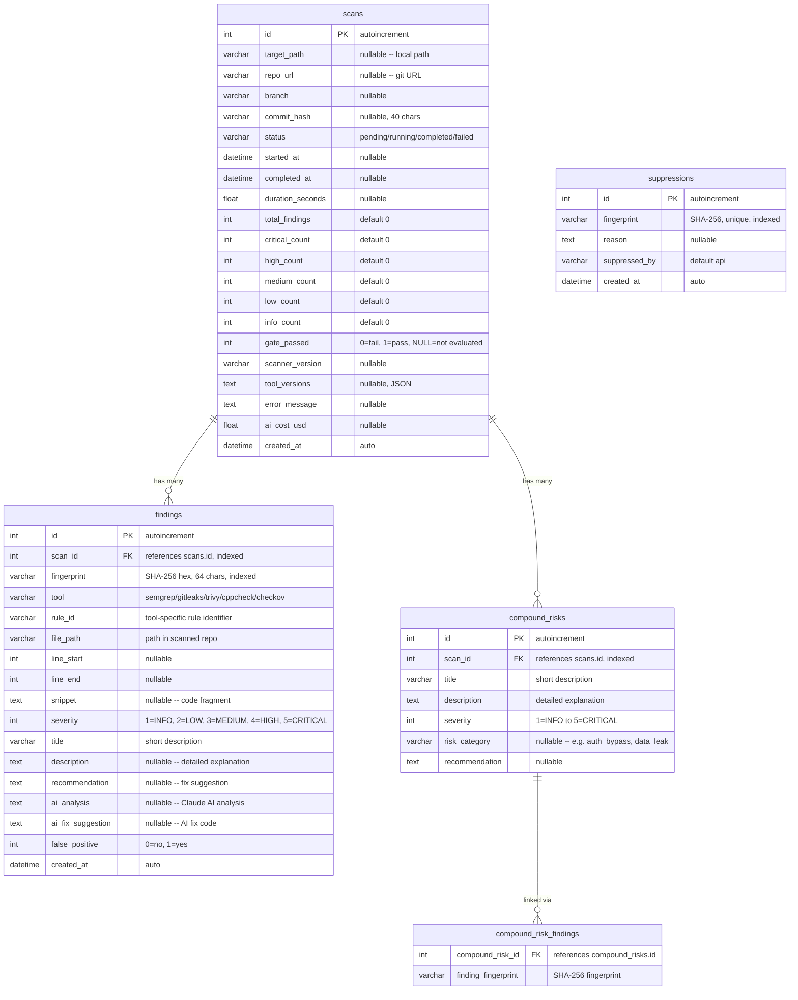

# Схема базы данных

## Обзор

База данных SQLite с режимом WAL (Write-Ahead Logging) для параллельного чтения. Управляется асинхронным ORM SQLAlchemy 2.0 с миграциями Alembic.

## ER-диаграмма



## Модели

### ScanResult

Отслеживает одно выполнение сканирования от запуска до завершения. Хранит агрегированные счётчики по уровням серьёзности для быстрых запросов панели управления. Поле `gate_passed` фиксирует результат шлюза качества: пройден (1), не пройден (0) или не оценивался (NULL).

### Finding

Нормализованная уязвимость безопасности, обнаруженная одним из пяти инструментов сканирования. Каждая находка имеет детерминированный `fingerprint` (SHA-256 от нормализованного пути + rule_id + фрагмента кода) для кросс-скановой дедупликации. Поля ИИ-обогащения (`ai_analysis`, `ai_fix_suggestion`) заполняются после анализа Claude.

### CompoundRisk

Составной риск, выявленный ИИ, который охватывает несколько отдельных находок. Например, обход аутентификации в одном компоненте в сочетании с IDOR в другом. Связан с соответствующими находками через ассоциативную таблицу `compound_risk_findings` по fingerprint.

### Suppression

Отслеживает fingerprint-ы, помеченные как ложные срабатывания. Когда fingerprint находки совпадает с записью подавления, она исключается из оценки шлюза качества и счётчиков отчётов.

## Уровни серьёзности

| Значение | Название | Требуемое действие |
|---------|----------|-------------------|
| 5 | CRITICAL | Немедленное исправление, блокирует развёртывание |
| 4 | HIGH | Исправить до релиза |
| 3 | MEDIUM | Исправить в текущем спринте |
| 2 | LOW | Исправить при возможности |
| 1 | INFO | Информационное, действий не требуется |

## Индексы

| Таблица | Столбец(ы) | Назначение |
|---------|-----------|-----------|
| findings | scan_id | Быстрый поиск находок по сканированию |
| findings | fingerprint | Запросы дедупликации и подавления |
| compound_risks | scan_id | Быстрый поиск составных рисков по сканированию |
| suppressions | fingerprint | Быстрое сопоставление подавлений (уникальное ограничение) |

## Конфигурация SQLite

Применяется к каждому соединению через обработчики событий SQLAlchemy:

```sql
PRAGMA journal_mode=WAL;      -- Write-Ahead Logging для параллельного чтения
PRAGMA synchronous=NORMAL;     -- Баланс между безопасностью и скоростью
PRAGMA foreign_keys=ON;        -- Принудительное соблюдение ограничений FK
```

## Расположение базы данных

| Окружение | Путь |
|----------|------|
| Docker | `/data/scanner.db` (именованный том `scanner_data`) |
| Локальная разработка | Настраивается через переменную `SCANNER_DB_PATH` или `db_path` в `config.yml` |

## Миграции

Alembic настроен для миграций схемы. Таблицы автоматически создаются при запуске приложения через `Base.metadata.create_all()` в обработчике жизненного цикла FastAPI.

```bash
# Создание новой миграции
alembic revision --autogenerate -m "description"

# Применение миграций
alembic upgrade head
```
